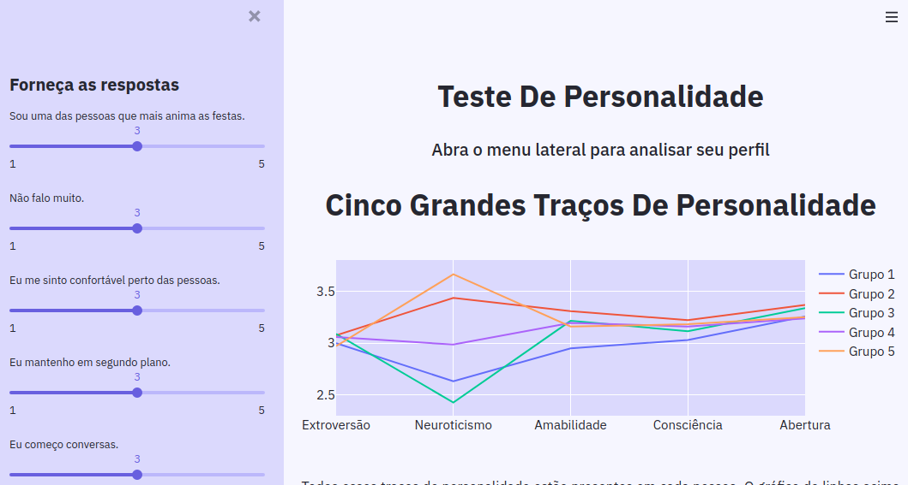

# Machine Learning
### Big Five Personality Traits

## How to run this project?

```bash
* Clone repository.                                        
    git clone git@github.com:hildebrando001/ML-personality-traits-test.git

* Create a virtualenv with Python3
    cd ML-personality-traits-test
    python3 -m venv .venv

* Activate the virtualenv
    source venv/bin/activate

* Install dependencies
    pip install -r requirements.txt

* Run the local server
    streamlit run Personality_Test.py
```





[](https://www.linkedin.com/in/jos%C3%A9-hildebrando-95746139/)

## Links

[Data -> Big Five Personality Traits](https://www.kaggle.com/tunguz/big-five-personality-test)
[About](https://www.verywellmind.com/the-big-five-personality-dimensions-2795422#:~:text=The%20five%20broad%20personality%20traits,how%20many%20personality%20traits%20exist.)


[Illustrations](https://undraw.co/search)